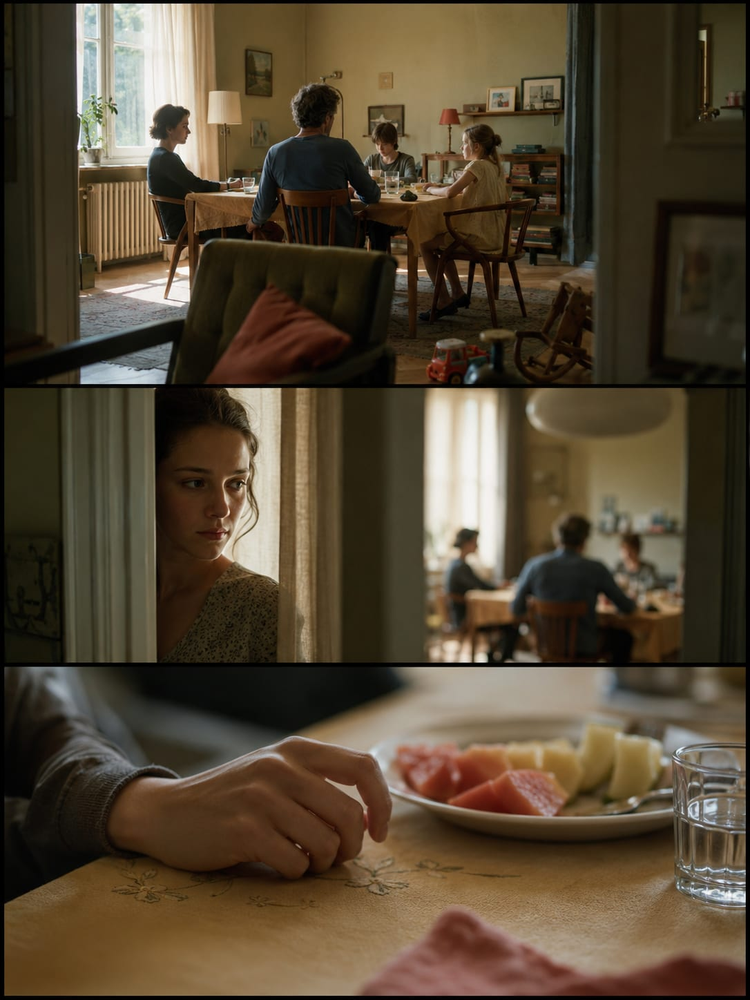

# CINEMA DNA

### 电影静帧 · 三联叙事 · 九镜故事板

**让每一个镜头都有理由，让画面之间发生故事。**

从一句剧情、一个人物或一张参考图出发，建立摄影机的位置、人物与空间的关系、光线和色彩，再把它发展成可以连续观看的电影画面。

**21:9 宽银幕方向 · 1 / 3 / 9 镜头 · 独立源图 · 连续性控制**

[快速开始](#快速开始) · [三种输出模式](#三种输出模式) · [工作流程](#工作流程) · [示例图库](#示例图库) · [安装与调用](#安装与调用) · [English](#english-overview)

| 家庭餐桌 · 距离与视线 | 雨夜赛场 · 身体与压力 |
| :---: | :---: |
|  |  |

## 它解决什么

电影感来自一个具体的判断：**摄影机为什么站在这里，这一刻为什么值得被看见。**

Cinema DNA 把这个判断落实到可执行的镜头设计：人物正在做什么，空间如何限制他们，观众先看到哪条信息，下一镜又改变了什么。颗粒、浅景深与综合色服务于这些关系。

**Skill 负责镜头与叙事设计、提示词和生成编排；图像模型负责逐镜生成；拼版工具负责组合已有镜头。** 它依赖所在环境实际提供的图像能力，本身不附带模型、API 密钥或视频生成服务。

## 三种输出模式

| 模式 | 适合什么 | 交付结构 |
| --- | --- | --- |
| **单帧 / Single Frame** | 先确定一个视觉方向或关键瞬间 | 1 张独立宽银幕画面 |
| **三联 / Triptych** | 一个事件中的三次信息变化 | 3 张独立镜头 + 1 张纵向三联图 |
| **九镜 / Nine-Shot Story** | 展开一个有选择、后果与连续动作的短场景 | 9 张独立镜头 + 3 张三联图 + 1 张 3×3 总览 |

未指定数量时通常使用三联；明确要求九镜、九宫格或需要更完整的故事推进时使用九镜。你指定的数量和交付形式优先。

仓库名称中的 **21:9** 表示宽银幕方向，当前镜头提示词以 **约 2.39:1** 为默认目标。严格的 21:9 与 2.39:1 并不相等；有精确尺寸要求时请直接指定。九宫格中的每格仍是横向宽银幕镜头，整张总览不必是正方形。

## 快速开始

不必先填写复杂表格。给出题材、一个正在发生的事件，以及最重要的限制，就可以开始。

### 先试一组三联

```text
使用 $cinema-dna-21x9x3。
清晨的老公寓，一家人已经开始吃饭，一个人却迟迟没有入座。
生成三个连续镜头，暖色自然光，人物始终在做事。
三个镜头要有不同的观看位置，保留独立源图，再拼成纵向三联。
```

### 用九镜讲一个短场景

```text
使用 $cinema-dna-21x9x3，生成九镜故事板。
暴雨将至，村民准备收起露天戏台，一名演员仍坚持把最后一段演完。
先把故事因果和人物、服装、戏台位置锁定，再逐镜生成。
不要依靠字幕解释剧情，不要让九张图都是同一个角度。
交付九张独立镜头、三组三联和一张 3×3 总览。
```

### 只要镜头方案与提示词

```text
使用 $cinema-dna-21x9x3。
设计一组雨中赛车的三联镜头，强调速度、视线阻挡和赛场压力。
只给精简的中文镜头说明与英文提示词，不生成图片。
```

### 只修一张失败镜头

```text
第 5 镜的人物服装和第 1 镜不一致。
只修第 5 镜，保留它原有的剧情功能、动作、机位和光线。
其他镜头不重做，替换完成后重新拼版。
```

## 工作流程

**故事与参考 → 镜头设计 → 独立生成 → 连续性检查 → 外部拼版**

| 阶段 | 解决的问题 | 形成的依据 |
| --- | --- | --- |
| **明确事件** | 谁遇到了什么具体问题？ | 一句可拍摄的冲突，必要时补充选择与后果 |
| **锁定连续性** | 什么内容不能在下一镜变掉？ | 人物、服装、关键道具、空间位置和光源清单 |
| **安排镜头** | 每一镜让观众多知道了什么？ | 动作、观看位置、构图、线索与前后变化 |
| **逐镜生成** | 怎样保留单独修改的能力？ | 各自独立的源图与对应提示词 |
| **检查与修正** | 哪一镜破坏了故事或身份？ | 对具体镜头补跑，保留已经成立的画面 |
| **拼版交付** | 怎样让镜头按正确顺序被观看？ | 三联或九宫格，以及可继续使用的独立源图 |

九镜通常按 **1–3 / 4–6 / 7–9** 分三批完成，每批返回后检查身份与空间关系。它不会要求图像模型直接在一张画布里画出九宫格。

## 设计规则

| 规则 | 对画面的实际要求 |
| --- | --- |
| **先有动作，再有气氛** | 用等待、递交、转身、阻挡等可见事件承载剧情 |
| **构图有理由** | 机位来自人物关系、空间限制和观众的观看立场 |
| **视线有去处** | 明确视线从哪里进入、被什么阻挡、最终落在哪里 |
| **每镜有信息变化** | 换角度之外，还要推进动作、关系或观众认知 |
| **连续性有基准** | 用少量稳定特征锁定人、物与空间，避免装饰越多越容易漂移 |
| **色彩有来源** | 颜色来自服装、墙体、天气与实景灯，而非统一滤镜 |
| **质感有分寸** | 让皮肤、衣物和环境保留摄影感，减少均匀锐化、塑料高光与过量特效 |
| **结尾有余地** | 第三镜可以是人物反应、关系变化或继续运行的现场，不固定成空场物件 |

九镜会检查规则、发现、选择、后果和代价之间的联系，并尝试“删掉这一镜会损失什么”的判断。具体执行规则见 [SKILL.md](SKILL.md) 与[九镜协议](references/nine-shot-story-protocol-v3.md)。

## 示例图库

以下是仓库保留的 **6 组三联案例**，用于观察镜头关系、构图和画面质感。它们不是九镜示例，也不代表当前版本对所有题材都已完成验证。仓库未提供完整的逐图生成记录，因此不推定各图使用的模型版本或原始提示词。

首页两组分别展示家庭餐桌和雨夜橄榄球；另外四组如下。点击图片可查看完整尺寸。

| 马术场 · 栏杆与运动方向 | 冰原矿城 · 队列与制度空间 |
| :---: | :---: |
|  |  |

| 候车室来信 · 窗口与信息 | 列车离别 · 内外与停顿 |
| :---: | :---: |
|  |  |

## 片名与海报：按需追加

需要发布作品时，可以在已确认的故事板基础上继续要求：

```text
根据这组已经确认的镜头，给出片名候选、英文名和一句故事介绍。
再设计一张 3:4 竖版主题海报，主视觉来自故事里的核心关系。
准确的片名与小字通过排版叠加，不要直接把分镜简单拼贴成海报。
```

这个阶段只在你明确要求时启用。主海报默认 **3:4**，16:9、1:1、9:16 可作为后续封面扩展。参考海报用于分析版式方法、视觉层级和字体气质，具体人物、文字和故事内容根据当前项目设计。

## 安装与调用

**[下载当前版本 ZIP](https://github.com/dacnay816y62-hub/cinema-dna-21x9x3/archive/refs/heads/main.zip)** · **[查看历史版本](https://github.com/dacnay816y62-hub/cinema-dna-21x9x3/releases)**

将解压后包含 `SKILL.md` 的文件夹放入所用助手的技能目录。当前仓库保留轻量 JPG 示例；旧版 Release 包含更大的历史图库。

### Codex CLI

已安装 Git 时，可直接克隆到技能目录。`--depth 1` 只下载当前历史深度，避免首次安装拉取全部旧图。

**Windows PowerShell：**

```powershell
$skillRoot = Join-Path $env:USERPROFILE '.agents\skills'
New-Item -ItemType Directory -Force -Path $skillRoot | Out-Null
git clone --depth 1 https://github.com/dacnay816y62-hub/cinema-dna-21x9x3.git (Join-Path $skillRoot 'cinema-dna-21x9x3')
```

**macOS / Linux：**

```bash
git clone --depth 1 https://github.com/dacnay816y62-hub/cinema-dna-21x9x3.git "$HOME/.agents/skills/cinema-dna-21x9x3"
```

目标文件夹已存在时，先确认它是否属于这个仓库，避免覆盖自己的修改。安装后在支持技能调用的对话中使用 **`$cinema-dna-21x9x3`**。

### 运行环境

- **生成图像：** 使用所在环境实际提供、或用户指定的图像工具；没有可用后端时交付镜头方案与提示词，并说明未生成图片。
- **九镜拼版：** 仓库附带的脚本基于 PowerShell 与 `System.Drawing`，建议在 Windows 环境执行。其他环境可使用可用的等效拼版工具，保持顺序、比例和独立源图。
- **仅要提示词：** 不需要图像生成服务，明确说“只要提示词，不出图”即可。

## 文件导航

| 文件 | 用途 |
| --- | --- |
| [SKILL.md](SKILL.md) | 单帧、三联与九镜的核心执行规则 |
| [九镜故事协议](references/nine-shot-story-protocol-v3.md) | 故事推进、连续性、镜头变化与逐镜恢复 |
| [摄影质感与节奏](references/cinema-dna-v4-anti-ai.md) | 光学质感、细节控制与三联节奏 |
| [单帧与三联方法库](references/cinema-dna-full-spec.md) | 焦段、构图、光线与题材参考；冲突时以核心规则为准 |
| [九镜拼版脚本](scripts/compose-nine-shot-storyboard.ps1) | 组织 9 张源图、3 张三联图和 1 张总览 |
| [调用配置](agents/openai.yaml) | 技能展示名称与默认调用示例 |

## 常见问题

**为什么不直接让模型画九宫格？**

独立生成便于核对人物、镜头和空间，也便于只替换出错的一张。拼版应组合已完成的镜头，保持内容可追溯。

**九张都好看，就算成功吗？**

还要看顺序是否有意义、动作是否推动结果、人物和道具是否连续。Skill 可以帮助搭建故事概念和镜头方案，深入创作仍需要你判断剧本是否合理。

**能保持人物百分之百一致吗？**

不能据此承诺。角色基准、参考图和连续性清单有助于减少漂移，实际结果仍需逐镜检查，必要时局部修正或补跑。

**它会生成视频吗？**

当前交付是静态电影镜头和故事板。可以作为后续视频制作的参考，但不会自动变成含动作、对白和声音的完整视频。

**画面太脏、太油或太像游戏怎么办？**

指出具体镜号和问题，保留已经成立的构图与动作，再减少过度锐化、均匀磨损、无来源光效和装饰性细节。问题通常需要可见的修正目标，而不只是追加一句“更电影感”。

**特写太多，反而看不清故事怎么办？**

明确写“不要面部、手部或物件特写，以能看清动作和空间关系的镜头为主”。Skill 应优先遵循你的景别限制，不为了画面精致而插入无助于剧情的细节镜头。

## FANTASY / 梵想美学

**让想象先被看见。**

Skill 帮助组织视觉判断和模型工具。好的剧本与好的画面共同组成作品，创作者的观察、取舍和判断仍然贯穿整个过程。

反馈可提交到 [Issues](https://github.com/dacnay816y62-hub/cinema-dna-21x9x3/issues)，附上题材、所用工具、出错镜号和希望保留的内容。公开示例请使用已获准分享的素材，并清理私人资料与图片元数据。

当前仓库未附加许可证。核心规则为 3.0 系列，最近的现有发行版为 [v3.0.1](https://github.com/dacnay816y62-hub/cinema-dna-21x9x3/releases/tag/v3.0.1)；主分支文档可继续更新。

## English overview

**Cinema DNA turns a subject, short story or reference into cinematic stills with deliberate camera placement, visible action and continuity.**

Choose one frame, a three-shot triptych, or a nine-shot story. Generate each shot independently, review character and spatial continuity, replace only failed shots, then compose the finished frames externally. The core workflow targets approximately 2.39:1 frames; the repository name uses 21:9 as its widescreen label.

The Skill provides shot design, prompts and orchestration. Image generation depends on the tools available in the host environment. Prompt-only requests stay text-only. Titles, posters and cover systems are added only when requested. This is a still-image and storyboard workflow, not a video generator.

The six gallery examples are existing triptychs, not nine-shot benchmarks or a guarantee of reproducibility. The supplied nine-shot compositor uses PowerShell and `System.Drawing`; Windows is the recommended execution environment.

Start with [SKILL.md](SKILL.md), the [nine-shot protocol](references/nine-shot-story-protocol-v3.md), or the [current download](https://github.com/dacnay816y62-hub/cinema-dna-21x9x3/archive/refs/heads/main.zip).

---

**让想象先被看见。** 将视觉判断与创作流程整理成可以继续使用的方法。

**[浏览全部视觉 Skills](https://github.com/dacnay816y62-hub?tab=repositories)** · [Fantasy Movie Poster](https://github.com/dacnay816y62-hub/fantasy-movie-poster-skill) · [Character Casting Studio](https://github.com/dacnay816y62-hub/character-casting-studio-skill)

本地技能目录与加载方式参见 [OpenAI 官方 Skills 文档](https://learn.chatgpt.com/docs/build-skills#where-codex-loads-local-skills)。
